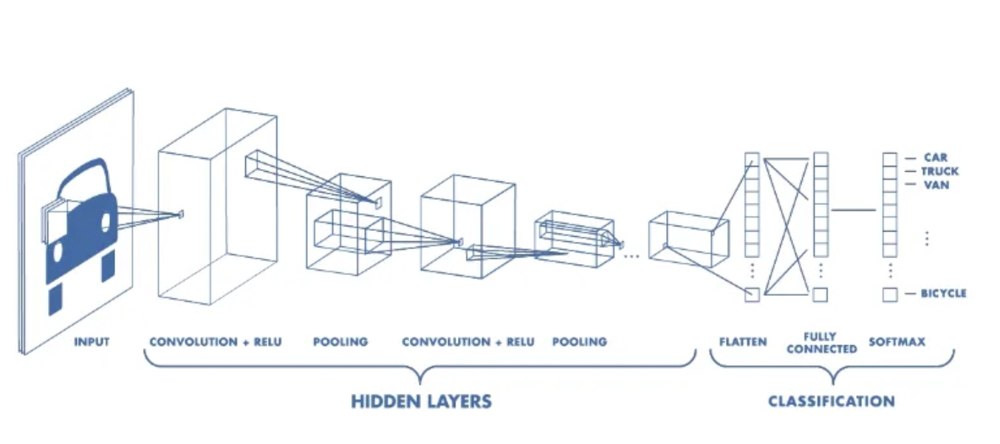
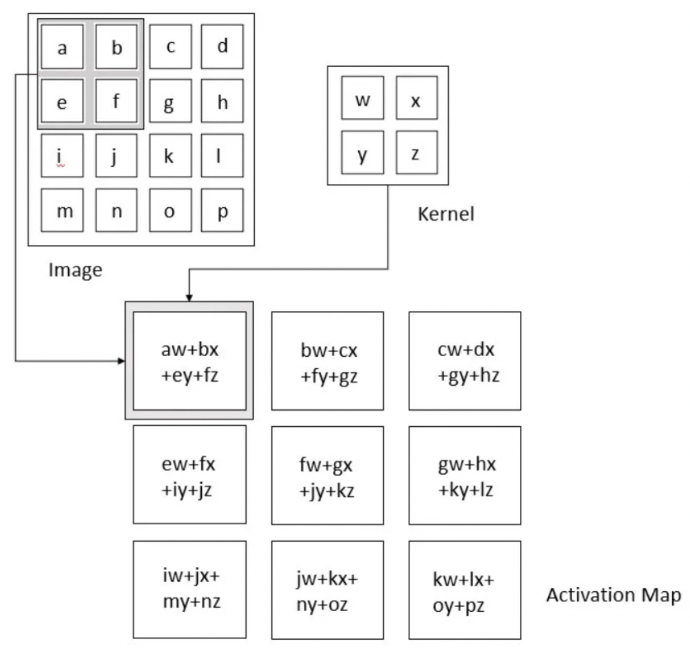
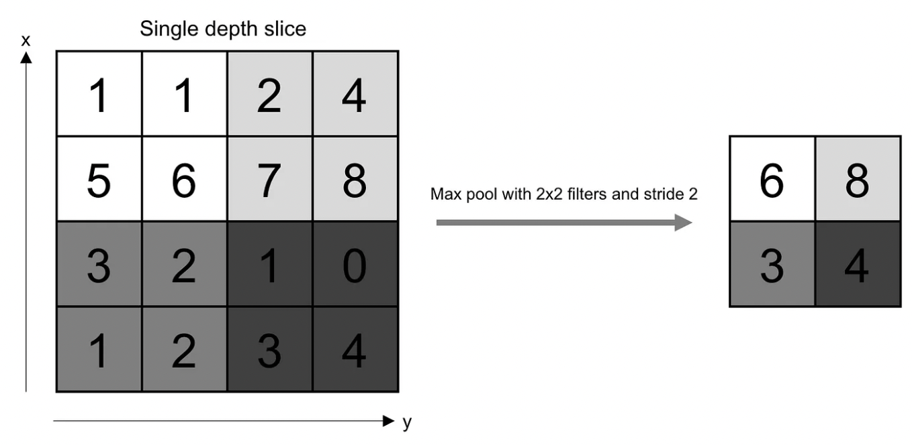

# Experimenting ways to improve the accuracy of the Convolutional Neural Network(CNN) using the CIFAR dataset. 

Modifying the existing code given at - https://pytorch.org/tutorials/beginner/blitz/cifar10_tutorial.html

## Understanding Convolutional Neural Networks

A Convolutional Neural Network, also known as CNN or ConvNet, is a class of neural networks that specializes in processing data that has a grid-like topology, such as an image.

### Intuition behind Convolutional Neural Networks

A digital image is a binary representation of visual data. It contains a series of pixels arranged in a grid-like fashion that contains pixel values to denote how bright and what color each pixel should be. The human brain processes a huge amount of information when we see an image. Each neuron is connected to other neurons in a way that they cover the entire visual field. As each neuron responds to stimuli only in the restricted region of the visual field also called the receptive field, each neuron in a CNN processes data only in its receptive field as well. The layers are arranged in such a way that they detect simpler patterns first (lines, curves, etc.) and more complex patterns (faces, objects, etc.) further along.

### CNN Architecture

A CNN typically has three layers: a convolutional layer, a pooling layer, and a fully connected layer.

Source: https://www.mathworks.com/videos/introduction-to-deep-learning-what-are-convolutional-neural-networks--1489512765771.html

### Convolution Layer

The convolution layer is the core building block of the CNN as it carries the major chunk of the network’s computational load.

This layer performs a dot product between two matrices, where one matrix is the set of learnable parameters otherwise known as a kernel, and the other matrix is the restricted portion of the receptive field. The kernel is spatially smaller than an image but is more in-depth. This means that, if the image is composed of three (RGB) channels, the kernel height and width will be spatially small, but the depth extends up to all three channels.

During the forward pass, the kernel slides across the height and width of the image-producing the image representation of that receptive region. This produces a two-dimensional representation of the image known as an activation map that gives the response of the kernel at each spatial position of the image. The sliding size of the kernel is called a stride.

The convolution operation can be seen below: 

Source: Deep Learning by Ian Goodfellow, Yoshua Bengio, and Aaron Courville

### Pooling Layer 

The pooling layer replaces the output of the network at certain locations by deriving a summary statistic of the nearby outputs. This helps in reducing the spatial size of the representation, which decreases the required amount of computation and weights. The pooling operation is processed on every slice of the representation individually.

There are several pooling functions such as the average of the rectangular neighborhood, the L2 norm of the rectangular neighborhood, and a weighted average based on the distance from the central pixel. However, the most popular process is max pooling, which reports the maximum output from the neighborhood.

The pooling operation can be seen below: 

Source: O’Reilly Media

### Fully Connected Layer

Neurons in this layer have full connectivity with all neurons in the preceding and succeeding layers as seen in regular FCNN. This is why it can be computed as usual by a matrix multiplication followed by a bias effect. The FC layer helps to map the representation between the input and the output.

### Non-Linearity Layers
There are several types of non-linear operations, some of them are:

1. Sigmoid

The sigmoid non-linearity has the mathematical form σ(κ) = 1/(1+e¯κ). It takes a real-valued number and “squashes” it into a range between 0 and 1.

However, a very undesirable property of sigmoid is that when the activation is at either tail, the gradient becomes almost zero. If the local gradient becomes very small, then in backpropagation it will effectively “kill” the gradient. Also, if the data coming into the neuron is always positive, then the output of the sigmoid will be either all positives or all negatives, resulting in a zig-zag dynamic of gradient updates for weight.

2. ReLU
   
The Rectified Linear Unit (ReLU) computes the function ƒ(κ)=max (0,κ). In other words, the activation is simply a threshold at zero. Unfortunately, a con is that ReLU can be fragile during training. A large gradient flowing through it can update it in such a way that the neuron will never get further updated. However, we can work with this by setting a proper learning rate.

## Observations from experiments

I tried to increase the accuracy of the model by implementing the following things and listing down my observations:

### 1. Running the training longer: 
Before the for loop runs for 2 loops. Increasing the for loop for 12 loops increases the accuracy to 60% and the loss decreased from 1.7 to 0.7. But the loss also increases in the middle and then again decreases. Increasing the for loop iterations to 22 loops, there is no change in accuracy. The accuracy remains constant at 60% and the loss decreases from 2.2 to 0.54. The loss does not continuously decrease, but it decreases overall. Increasing the for loop iterations to 32 loops decreases the accuracy from 60 to 59% and the loss decreases from 2.2 to 0.6 

Thus we can see that increasing the training time for a much longer time does not help in increasing the accuracy. What happens when we try to increase the training time is the model goes from underfitting to optimal to overfit after some time. As we can see above, the model goes from 54% to 60% but stays constant at 60% when you from 12 to 22 loops. And we should train the model longer only when we have a huge amount of data. 

### 2 - Changing the learning rate and other hyperparameters: 
When we change the learning rate to 0.01 and keep the momentum the same, the accuracy decreases drastically to 10% It is the same when we make the learning rate 0.00001, the accuracy is 11% Here the loss decreases and immediately keeps on increasing. When we decrease the learning rate the accuracy drops drastically. When we decrease the learning rate to 0.00001 and momentum to 0.2, the accuracy remains low at 10% With learning rate (lr) = 0.001 and momentum = 0.5 the 
accuracy jumps from 10 to 50%

Thus, keeping a small learning rate and large momentum decreases the accuracy of the model(around 10%). In this case, the model becomes better at classifying only a single class label, in our case we can see that at first, only the cat has an accuracy of 95%, and at second only the dog has an accuracy of 94%. A medium-range momentum and a small learning rate gives somewhat better accuracy (around 50%). 

### 3 - Change the number or sizes of the fully connected layers:
When we change the number of fully connected layers to 4, the accuracy decreases from 54% to 47% and when we change the number of fully connected layers to 5 the accuracy increases back to 54% Changing the number of fully connected layers to 10, the accuracy increases a little, it becomes 56% Thus increasing the number of fully connected layers, increases the accuracy of the model because as we increase the layers, the feature extraction becomes more specific.

### 4 – Nonlinear function other than ReLU:
Using ReLU we got the model accuracy as 54% and using tanh as the activation function, the model accuracy is 55%, and with sigmoid, it is 10% The model performs the worst with sigmoid activation as it just learns to classify a single class, giving us the accuracy of the class bird as 100% Thus we can observe that ReLU is the better option to choose as an activation function.

### 5 – Adding a dropout layer:
Adding a dropout layer, the accuracy of the model remains constant at 54% The accuracy of the model does not increase because our model is not overfitting. It has yet to reach the optimal stage. Thus adding a dropout layer does not help in increasing the accuracy of the model. 

### Integrating everything together: 
In the final model, we increased the fully connected layers, added a dropout layer, changed the momentum to 0.5, and increased the training time to 12 epochs. We see that the accuracy of the model increases from 54% to 63% Adding the dropout layer does not help, because the size of our dataset is very small. However, increasing the training period significantly (not too much) and adding the fully connected layers helps in increasing the accuracy of the model. The learning rate of 0.001 is appropriate, as we had seen that decreasing the learning rate decreased the accuracy. Comparing the accuracy of each class from before and after we observe that the accuracy is increased for all classes but dog, and we can conclude that the model is performing better than before.

Reference - https://towardsdatascience.com/convolutional-neural-networks-explained-9cc5188c4939
